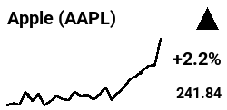

# Inky Stocks

A stock ticker for Raspberry Pi Zero & Pimoroni Inky pHAT, using the Yahoo Finance API to display daily stock performance.

- Choose any symbol on Yahoo Finance 
- Displays the last day available if the market is closed
- Works for 24/7 symbols like BTC-USD
- Graphs part of the previous day trend if the market hasn't been open long


## Setup

You'll need a Raspberry Pi Zero (2) with a [Pimoroni Inky pHAT installed](https://learn.pimoroni.com/article/getting-started-with-inky-phat). The program only draws in black and white, but it should work with any 250x122 variant of the display.

1. Activate your Python virtual environment, e.g. the default from the install guide:

   ```
   source ~/.virtualenvs/pimoroni/bin/activate
   ```

2. Install the dependencies:

   ```
   pip install -r requirements.txt
   ```

## Example usage

| Index | Stock | Crypto |
|---------|-------------|---------|
| `python stocks.py --symbol ^FTSE` | `python stocks.py --symbol AAPL` | `python stocks.py --symbol BTC-USD` |
|  |  |  |

If you don't provide a `--symbol` parameter it defaults to ^GSPC (S&P 500).

### Auto refresh

1. Create a bash script with your configuration:

    ```
    #!/bin/bash
    source ~/.virtualenvs/pimoroni/bin/activate
    python ~/inky-stocks/stocks.py --symbol ^FTSE
    ```
	
2. Make it executable:

    ```
    chmod +x ~/inky-stocks/run.sh
    ```

3. Add a cron job to run the script (e.g. every 15 minutes):

    ```
    crontab -e
    ```

    ```
    */15 * * * * python ~/inky-stocks/run.sh &
    ```

## Disclaimer

Obviously this is just for fun, there are no gurantees about the accuracy of the data, and you shouldn't use this to make any financial decisions. :)
