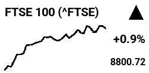

# Inky Stocks

A stock ticker for the Raspberry Pi Zero & Pimoroni Inky pHAT, fetching daily stock performance from the Yahoo Finance API:

- Supports any symbol on Yahoo Finance 
- Displays the most recent day if the market is closed
- Works for 24/7 symbols like BTC-USD
- Plots the end of the previous day if the market opened <2 hours ago


Optionally, if you install the Pimoroni LED SHIM, it will light up green or red depending on whether the stock value is up or down.

## Setup

You'll need a Raspberry Pi Zero 2 (or WH) with the [Pimoroni Inky pHAT installed](https://learn.pimoroni.com/article/getting-started-with-inky-phat) (current 250x122 resolution version only). 

1. Activate your Python virtual environment, e.g. the default from the Inky pHAT install guide:

   ```
   source ~/.virtualenvs/pimoroni/bin/activate
   ```

2. Install the dependencies:

   ```
   pip install -r requirements.txt
   ```

## Example usage

| Index | Stock | Crypto |
|---------|-------------|---------|
| `python stocks.py --symbol ^FTSE` | `python stocks.py --symbol AAPL` | `python stocks.py --symbol BTC-USD` |
|  |  |  |

If you don't provide a `--symbol` parameter the script defaults to ^GSPC (S&P 500). Add the `--three-color` flag if you have the black/white/red variant of the display and you want the red highlights.

### Auto refresh

1. Create a bash script with your configuration (`touch run.sh`) and make it executable (`chmod +x run.sh`):

    ```
    #!/bin/bash
    source ~/.virtualenvs/pimoroni/bin/activate
    python ~/inky-stocks/stocks.py --symbol ^FTSE --three-color
    ```

1. Add a cron job to run the script every 15 minutes:

    ```
    crontab -e
    ```

    ```
    */15 * * * * python ~/inky-stocks/run.sh &
    ```

## Disclaimer

Obviously this is just for fun, there are no gurantees about the accuracy of the data, and you shouldn't use this to make any financial decisions. :)
